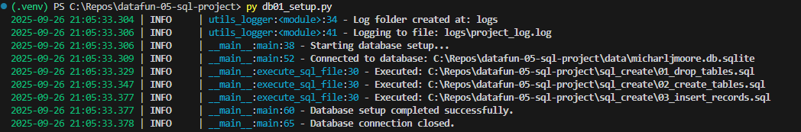
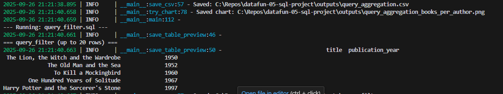

# datafun-05-sql
**Author:** Michael J Moore  
**Date:** September 26, 2025  

---

## 📌 Overview
This project is part of **CC5.1–CC5.4: Python + SQL**.  
It demonstrates how to use Python and SQL together to:

- Create and connect to a local SQLite database  
- Define related tables for **authors** and **books**  
- Insert records from CSV files and SQL scripts  
- Run update and delete operations with SQL scripts  
- Query, filter, sort, group, and join data  
- Execute SQL from Python and summarize results with Pandas + Matplotlib  
- Manage project dependencies and virtual environments  

The goal is to practice building clean, repeatable Python + SQL workflows.

---

## ⚙️ Setup Instructions
Follow these steps to run this project on your local machine.

### 1) Clone this repository
```bash
cd ~/Repos
git clone https://github.com/<your-username>/datafun-05-sql.git
cd datafun-05-sql
```

### 2) Create and activate a virtual environment
**Mac/Linux:**
```bash
python3 -m venv .venv
source .venv/bin/activate
```

**Windows PowerShell:**
```bash
py -3.12 -m venv .venv
.\.venv\Scripts\Activate
```

### 3) Install dependencies
```bash
pip install --upgrade pip
pip install -r requirements.txt
```

---

## ▶️ How to Run (order matters)

Rebuild schema (drops/recreates tables and inserts records):
```bash
python db01_setup.py
```

Apply features (updates, deletes, engineered columns):
```bash
python db02_features.py
```

Run queries (aggregation, filter, sort, group, joins):
```bash
python db03_queries.py
```


---

## 🧠 Skills Practiced
- Using `sqlite3` from the Python Standard Library  
- Writing and executing SQL from Python  
- Aggregation (COUNT, AVG, SUM)  
- Filtering (WHERE), Sorting (ORDER BY), Grouping (GROUP BY), Joining (INNER/LEFT JOIN)  
- Updates and deletes via standalone SQL scripts  
- Clean project structure, virtual environments, and documentation  

---

## 📂 Project Structure
```
datafun-05-sql-project/
├── data/
│   └── michaeljmoore.db.sqlite      # SQLite DB
│
├── outputs/                         # Generated CSVs, charts, summaries
│   ├── query_aggregation.csv
│   ├── query_aggregation_books_per_author.png
│   ├── query_filter.csv
│   ├── query_filter_pubyear_hist.png
│   ├── query_group_by.csv
│   ├── query_join.csv
│   ├── query_join_pubyear_hist.png
│   ├── query_sorting.csv
│   └── query_sorting_pubyear_hist.png
│
├── sql_create/
│   ├── 01_drop_tables.sql
│   ├── 02_create_tables.sql
│   └── 03_insert_records.sql
│
├── sql_features/
│   ├── update_records.sql
│   └── delete_records.sql
│
├── sql_queries/
│   ├── query_aggregation.sql
│   ├── query_filter.sql
│   ├── query_sorting.sql
│   ├── query_group_by.sql
│   └── query_join.sql
│
├── db01_setup.py
├── db02_features.py
├── db03_queries.py
├── analyze_queries.py
├── utils_logger.py
├── requirements.txt
├── .gitignore
└── README.md
```

---

## 🗃️ Database Overview

This project uses a **2-table schema**:

### authors
- `author_id` (TEXT, PK)  
- `name` (TEXT)  
- `birth_year` (INTEGER)  
- `nationality` (TEXT)  

### books
- `book_id` (TEXT, PK)  
- `title` (TEXT)  
- `genre` (TEXT)  
- `publication_year` (INTEGER)  
- `author_id` (FK → authors.author_id)  

**Relationship:**  
- One author → many books  

---

## 📖 Narrative of the Data
The dataset models a collection of **classic authors and their works**:  

- **Authors** include J.K. Rowling, George Orwell, Jane Austen, Mark Twain, and others.  
- **Books** include *Harry Potter*, *1984*, *Pride and Prejudice*, *The Great Gatsby*, and *The Hobbit*.  
- Each book record stores a publication year and genre, with a foreign key pointing back to its author.  

This structure supports questions like:
- How many books has each author written?  
- What is the distribution of publication years?  
- How do genres break down across different authors?  

---

## 📊 Example Findings
Typical outputs include:

- **Books per author:** Bar chart showing counts per author  
- 
- **Publication year distribution:** Histogram of book release years  
- 
- **Group by nationality:** Average publication year per nationality  
  
- **Joined table:** Books listed with author names  
  

---

## 📸 Screenshots
Screenshots show the code working in VS Code and the results.

### Example: Running `db01_setup.py`


### Example: Aggregation Query Output


---

## ✅ Notes
- Ensure `michaeljmoore.db.sqlite` is **ignored by git** (see `.gitignore`).  
- Run scripts in order (`db01_setup.py` → `db02_features.py` → `db03_queries.py`).  
- SQLite supports `INNER JOIN` and `LEFT JOIN`, but not `RIGHT JOIN`.  

---


